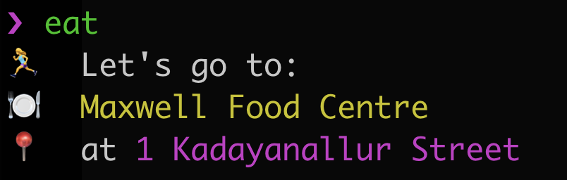

# eat

A simple cli tool to suggest which hawker center to go to from a predefined list of hawker centers



## Install package

```sh
npm install --gloabl @thoughtworks-jumpstart/eat
```

## Usage

```sh
$ eat
$ Let\'s go to Market Street Interim Hawker Centre at 5 Cross Street Market Street
```

## Usage without installation

```sh
npx @thoughtworks-jumpstart/eat
```
